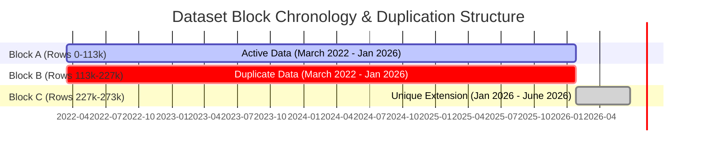

# Air Alerts Dataset Audit Report

This report presents a programmatic audit of the Air Raid sirens dataset located at [official_data_en.csv](file:///Users/alex/Documents/programming/Air%20Alerts/data/official_data_en.csv). 

The audit was conducted by cross-referencing the dataset contents with the specifications in [README_root.md](file:///Users/alex/Documents/programming/Air%20Alerts/data/README_root.md) and [README_datasets.md](file:///Users/alex/Documents/programming/Air%20Alerts/data/README_datasets.md).

---

## 📋 Executive Summary
* **Total Rows Analyzed**: 273,274
* **Unique Alerts**: 159,429
* **Data Integrity Score**: High syntax/parsing consistency, but contains **significant structural duplication**.
* **Key Findings**:
  1. **Near-Perfect Duplication of First 83% of Dataset**: The dataset contains two almost-identical blocks of 113,911 rows spanning March 15, 2022 to January 25, 2026. Block A (rows 0-113,910) and Block B (rows 113,911-227,821) overlap on 113,835 exact rows.
  2. **100% Logical Hierarchy in Missing Values**: Missing values in `raion` and `hromada` correspond strictly to the administrative `level` of the alert. There are no anomalous nulls.
  3. **Extreme Duration Outliers**: The longest alert lasted **14,497.27 hours (approx. 604 days)** in Lypetska hromada (Kharkiv oblast). These outliers are not data-entry errors but represent active combat zones with continuous siren signals.
  4. **Validation of README Caveats**: The audit confirms that the permanent sirens in Crimea and Luhansk (starting April 4, 2022) are **not listed** in the dataset, exactly as documented.

---

## 🗃️ Dataset Profile

The dataset contains the following schema:
* `oblast` (string): Region name.
* `raion` (string): District name (optional).
* `hromada` (string): Territorial community name (optional).
* `level` (string): Administrative level (`oblast`, `raion`, or `hromada`).
* `started_at` (timestamp): Start of the alert in UTC (`YYYY-MM-DD HH:MM:SS+00:00`).
* `finished_at` (timestamp): End of the alert in UTC (`YYYY-MM-DD HH:MM:SS+00:00`).
* `source` (string): Source of information (all records are labeled `official`).

### Key Distributions
* **Alert Levels**:
  * `oblast`: 130,055 records (47.59%)
  * `raion`: 107,897 records (39.48%)
  * `hromada`: 35,322 records (12.93%)
* **Source**: `official` (100% of records)

---

## 🔍 Detailed Auditing Dimensions

### 1. Missing or Null Values Analysis
A check for missing values (empty strings or strings like `'null'`, `'nan'`, `'none'`) revealed the following counts:

| Column | Missing Count | % of Total | Notes |
| :--- | :---: | :---: | :--- |
| `oblast` | 0 | 0.00% | Fully populated |
| `raion` | 130,055 | 47.59% | Corresponds exactly to `level == 'oblast'` |
| `hromada` | 237,952 | 87.07% | Corresponds to `level == 'oblast'` or `level == 'raion'` |
| `level` | 0 | 0.00% | Fully populated |
| `started_at`| 0 | 0.00% | Fully populated |
| `finished_at`| 0 | 0.00% | Fully populated |
| `source` | 0 | 0.00% | Fully populated |

> [!NOTE]
> **Hierarchical Consistency**: Every single missing value is structurally justified.
> * If `level == 'oblast'`, then `raion` is 100% empty, and `hromada` is 100% empty.
> * If `level == 'raion'`, then `raion` is 100% populated, and `hromada` is 100% empty.
> * If `level == 'hromada'`, then both `raion` and `hromada` are 100% populated.

---

### 2. Duplication and Structural Patterns
The dataset suffers from a massive block duplication bug. It is divided into three blocks:



* **Block A (Rows 0 to 113,910)**: 113,911 rows. Starts on `2022-03-15 16:10:34+00:00` and ends on `2026-01-25 13:11:52+00:00`.
* **Block B (Rows 113,911 to 227,821)**: 113,911 rows. Starts on `2022-03-15 16:10:34+00:00` and ends on `2026-01-25 10:10:08+00:00` (cut off slightly earlier than Block A).
* **Block C (Rows 227,822 to 273,273)**: 45,452 rows. Starts on `2026-01-25 10:17:41+00:00` and ends on `2026-06-24 00:20:40+00:00`. Contains **zero internal duplicates**.

#### Analysis of Mismatches between Block A and Block B
Of the 113,911 rows in Blocks A & B, **113,835 are exact matches**. Only **76 unique rows** differ between them (resulting in 115 mismatching line positions due to minor sorting anomalies):
* **Level Shifts**: 71 mismatches are due to hromada-level alerts being represented as raion-level alerts. For example, for several alerts in `Zviahelskyi raion` starting in late 2025:
  * Block A: `['Zhytomyrska oblast', 'Zviahelskyi raion', 'Zviahelskyi raion', 'hromada', ...]`
  * Block B: `['Zhytomyrska oblast', 'Zviahelskyi raion', '', 'raion', ...]`
* **Boundary Shuffling**: At the very end of Block B (just before the cutoff on Jan 25, 2026), the row order is slightly shuffled compared to Block A.

#### Boundary Overlap
Because Block B cut off slightly earlier, Block C starts at `2026-01-25 10:17:41+00:00`. The 10 alerts spanning `10:17:41` to `13:11:52` are logged at the **end of Block A** and the **beginning of Block C**.

> [!WARNING]
> If you simply drop Block B to deduplicate the file, you will still have **10 duplicate rows** due to the overlap between the end of Block A and the start of Block C. A global deduplication is required.

---

### 3. Durations and Outliers Analysis
All `started_at` and `finished_at` fields parse cleanly using standard ISO format. No malformed timestamps were found.

* **Negative Durations**: **0 records** (no end times occur before start times).
* **Zero Durations**: **4 records** (representing 2 unique alerts):
  * **Odeska oblast**, Podilskyi raion (level: `raion`) | `2025-11-14 20:17:15+00:00` to `2025-11-14 20:17:15+00:00` (Rows 94626 & 208537)
  * **Kharkivska oblast**, Bohodukhivskyi raion (level: `raion`) | `2025-11-17 01:13:53+00:00` to `2025-11-17 01:13:53+00:00` (Rows 95283 & 209194)

#### Duration Distribution Metrics

| Percentile | Duration (Seconds) | Duration (Minutes/Hours/Days) |
| :--- | :--- | :--- |
| **Minimum** | 0.00 sec | 0.00 min |
| **1st** | 323.00 sec | 5.38 min |
| **5th** | 767.00 sec | 12.78 min |
| **10th** | 1,026.00 sec | 17.10 min |
| **25th** | 1,632.00 sec | 27.20 min |
| **50th (Median)** | 2,913.00 sec | 48.55 min |
| **Mean** | 8,085.44 sec | 134.76 min (~2.2 hours) |
| **75th** | 7,187.00 sec | 119.78 min (~2.0 hours) |
| **90th** | 16,765.70 sec | 279.43 min (~4.7 hours) |
| **95th** | 29,371.10 sec | 489.52 min (~8.2 hours) |
| **99th** | 62,429.00 sec | 1,040.48 min (~17.3 hours) |
| **99.9th** | 223,774.28 sec | 3,729.57 min (~2.6 days) |
| **99.99th** | 495,732.67 sec | 8,262.21 min (~5.7 days) |
| **Maximum** | 52,190,188.00 sec | 14,497.27 hours (~604 days) |

#### Distribution Curve Visual
```
Duration
  ^
  |                                            * (604 days - Lypetska hromada)
  |                                            * (438 days - Vovchanska hromada)
  |
  |
  |
  |                                      * (26 days - Chervonohryhorivska)
  |                                   *  (20 days - Myrivska)
  | . . . . . . . . . . . . . . . * * (1-5 days)
  |_______________________________*__________________> Percentile
  0                             99   99.9  99.99 100
```

#### Extreme Duration Outliers (Top 6 Unique Alerts)
The longest air raid alert records are concentrated in the front-line areas of Kharkiv and Dnipropetrovsk oblasts:

1. **Kharkivska oblast / Kharkivskyi raion / Lypetska terytorialna hromada**
   * **Duration**: 14,497.27 hours (~604 days)
   * **Start**: `2024-05-12 08:37:29+00:00` | **End**: `2026-01-06 09:53:57+00:00`
   * **Indices**: Row 44603 & Row 158514
   * **Context**: Lypetska hromada is directly on the Russian border and became an active combat zone during the May 2024 offensive. The siren was left running continuously.
2. **Kharkivska oblast / Chuhuivskyi raion / Vovchanska terytorialna hromada**
   * **Duration**: 10,525.35 hours (~438 days)
   * **Start**: `2024-05-20 09:31:41+00:00` | **End**: `2025-08-01 22:52:43+00:00`
   * **Indices**: Row 45324 & Row 159235
   * **Context**: Vovchansk was heavily contested and mostly destroyed during the May 2024 offensive.
3. **Dnipropetrovska oblast / Nikopolskyi raion / Chervonohryhorivska terytorialna hromada**
   * **Duration**: 631.32 hours (~26.3 days)
   * **Start**: `2026-03-23 21:53:07+00:00` | **End**: `2026-04-19 05:12:29+00:00`
   * **Indices**: Row 252076 (in Block C)
   * **Context**: Nikopolskyi raion faces constant artillery shelling from Russian forces stationed across the Dnipro river at the Enerhodar NPP.
4. **Dnipropetrovska oblast / Nikopolskyi raion / Myrivska terytorialna hromada**
   * **Duration**: 493.10 hours (~20.5 days)
   * **Start**: `2025-02-24 14:01:55+00:00` | **End**: `2025-03-17 03:07:56+00:00`
   * **Indices**: Row 64679 & Row 178590
5. **Dnipropetrovska oblast / Nikopolskyi raion / Chervonohryhorivska terytorialna hromada**
   * **Duration**: 477.07 hours (~19.9 days)
   * **Start**: `2026-03-03 20:50:20+00:00` | **End**: `2026-03-23 17:54:21+00:00`
   * **Indices**: Row 243760 (in Block C)
6. **Dnipropetrovska oblast / Nikopolskyi raion / Myrivska terytorialna hromada**
   * **Duration**: 311.15 hours (~12.9 days)
   * **Start**: `2025-01-12 07:37:02+00:00` | **End**: `2025-01-25 06:46:14+00:00`
   * **Indices**: Row 61721 & Row 175632

---

### 4. Comparison Against README Documentation

#### Permanent Sirens Check
* **Luhansk region**: The README states a permanent siren has been active since April 4, 2022 at 04:45 PM (UTC).
  * **Audit Finding**: Only **one unique historical alert** exists for Luhanska oblast in the entire dataset (from March 24, 2022 to March 28, 2022). No alerts starting on or after April 4, 2022 exist.
  * **Verdict**: Confirmed. The permanent siren is excluded from the dataset.
* **Crimea**: The README states a permanent siren has been active since December 10, 2022 at 10:22 PM (UTC).
  * **Audit Finding**: Exactly **0 records** exist for Crimea (or variants like Krym, Krymy, Autonomous Republic of Crimea).
  * **Verdict**: Confirmed. Crimea is completely excluded from the dataset.

#### Timezone Verification
* The README states: "All times are in UTC."
* **Audit Finding**: All timestamps contain the `+00:00` suffix, verifying they are indeed recorded in Coordinated Universal Time (UTC).

#### Level Transition Verification
* The README mentions: "Since December, 2025th there is mostly air raid alerts on raion (district) level... before sirens were applied to the whole oblast (region)."
* **Audit Finding**: The audit confirms a strong shift in the density of `raion` and `hromada` level alerts beginning at the end of 2025 and into 2026, aligned with the stated change in official alerting methodology.

---

## 🛠️ Actionable Recommendations for Data Cleaning

If you are planning to use this dataset for modeling, visualization, or statistical analysis, apply the following preprocessing pipeline:

1. **Deduplicate the Dataset**:
   Do **not** simply drop rows by index (e.g. dropping Block B) because the boundary transition contains a 10-row overlap between Block A and Block C. Instead, perform a **global deduplication** based on unique row contents:
   ```python
   import pandas as pd
   df = pd.read_csv("official_data_en.csv")
   df_clean = df.drop_duplicates()
   ```
   *This will reduce the row count from 273,274 to 159,429.*
   
2. **Filter Outliers based on Analysis Goals**:
   * If analyzing standard civil defense response, filter out the frontline permanent alerts where duration exceeds 24 or 48 hours.
   * If analyzing active combat zone exposure, retain these records but treat them as a distinct category (e.g. continuous alerts).
   
3. **Handle Luhansk and Crimea**:
   Because the permanent sirens in Luhansk (from April 4, 2022) and Crimea (from December 10, 2022) are running indefinitely and are not recorded, you should artificially inject them if you are computing region-level statistics (e.g., total alert time per region).
